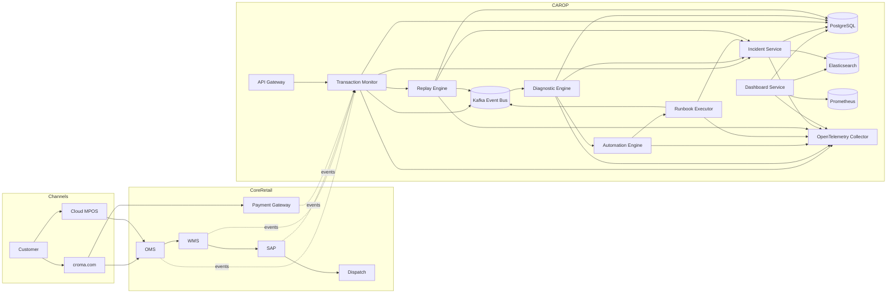

# CAROP System Architecture

## Enterprise Context

CAROP continuously monitors retail transaction chains and automatically recovers operations.

### Business flows

1. Online order flow: `Customer -> croma.com -> OMS -> WMS -> SAP -> Dispatch`
2. Store billing flow: `Customer -> Cloud MPOS -> OMS -> WMS -> SAP`
3. Inventory flow: `WMS -> OMS -> croma.com -> MPOS`

## Architecture Diagram

## Detect -> Diagnose -> Auto Fix -> Recovery Sequence

1. `transaction-monitor` detects flow anomaly or SLA breach.
2. Event emitted to Kafka topic `carop.anomaly.detected`.
3. `diagnostic-engine` runs health probes (API, DB, queue, k8s, auth, network).
4. Root cause event emitted to `carop.rca.completed`.
5. `automation-engine` selects runbook and emits execution plan.
6. `runbook-executor` performs actions via Kubernetes API, Ansible, SSH.
7. `replay-engine` replays failed transactions from recovery queue.
8. `incident-service` tracks state transitions and audit evidence.
9. `dashboard-service` exposes real-time status for command center.

## Service Responsibilities

- API Gateway: JWT/OAuth2 validation, RBAC, rate limiting, request signing.
- Transaction Monitor: transaction graph correlation and KPI/SLO monitoring.
- Diagnostic Engine: deterministic checks + heuristic scoring for root cause.
- Automation Engine: policy guardrails, action approvals, blast-radius limits.
- Runbook Executor: pluggable action adapters (`k8s`, `ansible`, `ssh`, `http-retry`, `queue-replay`).
- Replay Engine: idempotent retry pipeline with backoff and deduplication keys.
- Incident Service: incident state machine + compliance audit log.
- Dashboard Service: health, incidents, metrics aggregation for React UI.

## Non-functional Requirements

- HA with horizontal scaling and stateless service design.
- Exactly-once semantic approximations using idempotency keys.
- MTTR optimization with automated remediation and replay.
- Full traceability using OpenTelemetry + structured audit logs.

## Autonomous Orchestration

CAROP includes an `orchestrator` microservice that consumes Kafka topics and executes the closed-loop pipeline without manual triggering:

1. Consume `carop.anomaly.detected` and call Diagnostic Engine.
2. Queue failed transaction in Replay Engine.
3. Consume `carop.rca.completed` and select remediation runbook.
4. Trigger Automation Engine and Runbook Executor.
5. Update Incident status to `pending-replay` and keep audit trace continuity.
